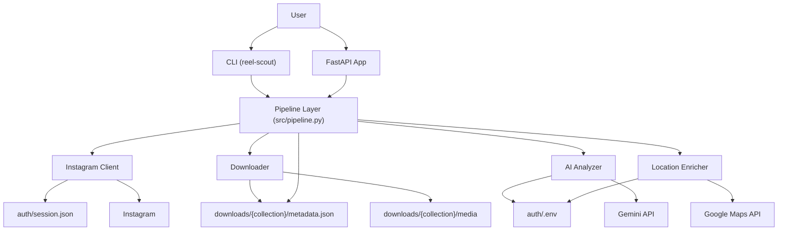

# System Patterns: ReelScout

*(This document outlines the current architecture, key technical decisions, and component relationships.)*

## Current Architecture

## Key Patterns
*   **Pipeline orchestration:** `src/pipeline.py` contains the main collect and analyze flows used by the backend and partly mirrored by the CLI.
*   **Modular boundaries:** Instagram access, downloading, AI analysis, and location enrichment are kept in separate modules.
*   **File-based state:** media and metadata are stored on disk; job state for the web app is stored in memory.
*   **Threaded background jobs:** the FastAPI app uses daemon threads for collect/analyze jobs because the downstream libraries are synchronous/blocking.
*   **Structured AI output:** Gemini caption analysis uses JSON output validated with Pydantic.

## Current Design Decisions
*   **Single-user backend model:** the backend and CLI currently use one session file at `auth/session.json`.
*   **Downloads layout:** current code writes into `downloads/{collection}/`.
*   **Dependency/runtime tooling:** `uv`.
*   **Package build backend:** `hatchling`.
*   **CLI framework:** `click`.
*   **Web framework:** `fastapi`.
*   **Instagram library:** `instagrapi`.
*   **Gemini library:** `google-genai`.
*   **Maps library:** `googlemaps`.

## Component Relationships
*   `reel_scout_cli.py`
    *   exposes `collect`, `analyze`, `serve`
    *   directly uses `InstagramClient`, `download_collection_media`, and `run_analyze_pipeline`
*   `src/pipeline.py`
    *   runs the tested collect/analyze workflows
    *   is the main orchestration layer for background jobs in the API
*   `src/api/app.py`
    *   serves the frontend
    *   exposes auth, collection, job, and result routes
    *   uses in-memory job tracking and SSE for progress updates
*   `src/downloader.py`
    *   downloads videos, photos, and carousel resources
    *   writes/updates `metadata.json`
*   `src/ai_analyzer.py`
    *   performs caption-based location extraction
    *   does not yet implement the planned video-analysis fallback
*   `src/location_enricher.py`
    *   converts extracted location names into Google Maps place details

## Known Architectural Mismatch
The frontend currently contains multi-user assumptions, but the backend and CLI are single-user. Until that mismatch is resolved, treat the backend and CLI as the canonical implementation and the frontend as partially ahead of the server contract.
